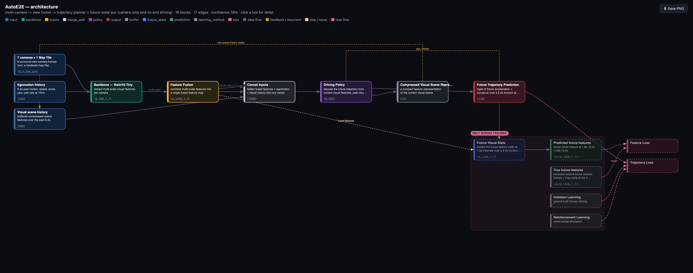

# visual-ml-model

**Read PyTorch model source code → a left-to-right architecture diagram** in the style of a
paper/README figure: multiple inputs on the left, the data spine through the middle, outputs
plus a pink loss column on the right, branching/merging, dashed loss & feedback edges, and an
**"ONLY DURING TRAINING"** band. The output is a single self-contained, dependency-free
`.html` file (inline SVG, "Save PNG" button) you can drop next to a paper or README.

The trick: **a large language model (Claude Code) reads the code** and decides the blocks,
the data flow, which branches are training-only, and where the losses are. Rule-based parsing
recovers the module list, but it can't tell you that a branch only runs under `if
self.training`, that several tensors are concatenated into one fusion block, or that a head's
output is compared against a target in a loss. That understanding is what the LLM supplies.



> Autoware's **AutoE2E** (camera-only end-to-end driving), generated from the code: inputs
> (cameras, egomotion, visual history) on the left → backbone → view fusion → driving policy →
> outputs, with the self-supervised future-state branch + losses banded under "ONLY DURING
> TRAINING" on the right. Each box shows what it does + its tensor shape.

---

## Why

Existing PyTorch visualizers (Netron, torchview, torchviz, torchinfo, `torch.fx`, TensorBoard
`add_graph`, …) are op/shape/parameter dumps that need a *runnable* model and produce a flat
graph of low-level ops — not a readable "how does this system fit together" figure with
inputs, outputs, losses, and training-only paths. This tool instead has an LLM read the
**source** (no execution, no install needed) and emit a high-level architecture graph, then
lays it out automatically into a clean paper-style figure.

Research model code often isn't runnable, so the pipeline is **LLM-first**: it never imports
or runs the model. Models commonly use a Registry/factory pattern, so you pass the constructor
args as a JSON config — and you can **pick which registry variant** to draw.

---

## Install

```bash
# Python 3.11+. No third-party Python dependencies (validator + renderer are stdlib only).
git clone git@github.com:riita10069/visual-ml-model.git && cd visual-ml-model

# The architecture-extraction step needs the `claude` CLI (Claude Code) on your PATH:
claude --version
# (Without it you can still render a pre-computed / hand-edited arch IR via `--arch`.)
```

---
